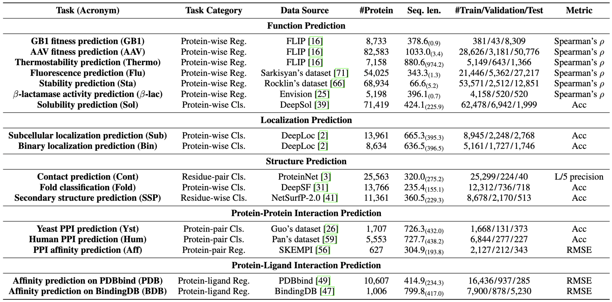

# PEER: A Comprehensive and Multi-Task Benchmark for Protein Sequence Understanding

This is the official codebase of the paper [PEER: A Comprehensive and Multi-Task Benchmark for Protein Sequence Understanding](https://arxiv.org/pdf/2206.02096.pdf), 
accepted by **NeurIPS 2022 Dataset and Benchmark Track** ([OpenReview link](https://openreview.net/forum?id=QgTZ56-zJou)).

[Minghao Xu*](https://chrisallenming.github.io),
[Zuobai Zhang*](https://oxer11.github.io),
[Jiarui Lu](https://mila.quebec/en/person/jiarui-lu/),
[Zhaocheng Zhu](https://kiddozhu.github.io),
[Yangtian Zhang](https://zytzrh.github.io/),
[Chang Ma](https://github.com/chang-github-00),
[Runcheng Liu](https://www.runchengliu.com/),
[Jian Tang](https://jian-tang.com)
(*equal contribution)

## Overview ##

PEER is a **comprehensive** and **multi-task** benchmark for protein sequence understanding. 
It contains 14 tasks of protein understanding lying in 5 task categories 
including protein function prediction, protein localization prediction, protein structure prediction, protein-protein interaction prediction and protein-ligand interaction prediction. 
On this benchmark, we evaluate different types of sequence-based methods for each task 
including traditional feature engineering approaches, different sequence encoding methods as well as large-scale pre-trained protein language models 
under both **single-task learning** and **multi-task learning** settings.



This codebase is based on PyTorch and [TorchProtein], an extension of [TorchDrug] specific to protein applications.
It supports training and inference with multiple GPUs or multiple machines.

[TorchProtein]: https://torchprotein.ai/
[TorchDrug]: https://torchdrug.ai/

## Installation ##

You may install the dependencies of TorchProtein and PEER benchmark as below. 
Generally, they work with Python 3.7/3.8 and PyTorch version >= 1.8.0.

```bash
conda create -n protein python=3.7
conda activate protein

conda install pytorch==1.8.0 cudatoolkit=10.2 -c pytorch
conda install scikit-learn pandas decorator ipython networkx tqdm matplotlib -y
conda install pytorch-scatter pytorch-cluster -c pyg -c conda-forge
pip install fair-esm transformers easydict pyyaml lmdb

python -m pip install git+https://github.com/DeepGraphLearning/torchdrug/
```

## Reproduction ##

### Experimental Configurations ###

We provide a yaml based config for each benchmark experiment in our paper. 
The configs of all baselines for single-task and multi-task learning are stored in ```./config/``` with the following folder structure:

```
config
 └── single_task
     ├── ESM
     │   ├── Task_ESM.yaml
     │   ├── Task_ESM_fix.yaml
     ├── ProtBert
     ├── LSTM
     ├── BERT
     ├── CNN
     ├── ResNet
     ├── DDE
     ├── Moran
 ├── multi_task
     ├── ESM
     │   ├── CenterTask_AuxiliaryTask_ESM.yaml
     ├── BERT
     ├── CNN
```

### Launch Experiments ###

In each config, we give a **suggested GPU configuration**, considering the tradeoff between *dataset size* and *computational resource*.
We assume **Tesla-V100-32GB GPUs** as the computational resource.
You can change this default configuration based on your own computational resource.

*Note.* The benchmark results can be reproduced by taking the mean and std of three runs with ```--seed 0```, ```--seed 1``` and ```--seed 2```. 

**Single-GPU.** By setting ```gpus: [0]```, the experiment is performed under a single GPU.
You can use the following command to run with seed 0, where all datasets will be automatically downloaded in the code.

Single-task learning experiment:
```bash
python script/run_single.py -c config/single_task/$model/$yaml_config --seed 0
```

Multi-task learning experiment:
```bash
python script/run_multi.py -c config/multi_task/$model/$yaml_config --seed 0
```

**Multi-GPU.** By setting ```gpus: [0,1,2,3]```, the experiment is performed under a single machine with 4 GPUs.
You can use the following command to run with seed 0.

Single-task learning experiment:
```bash
python -m torch.distributed.launch --nproc_per_node=4 script/run_single.py -c config/single_task/$model/$yaml_config --seed 0
```

Multi-task learning experiment:
```bash
python -m torch.distributed.launch --nproc_per_node=4 script/run_multi.py -c config/multi_task/$model/$yaml_config --seed 0
```

**Multi-Machine.** By setting ```gpus: [0,1,2,3,0,1,2,3]```, the experiment is performed under 2 machines with 4 GPUs in each machine.
You can use the following command to run with seed 0.

Single-task learning experiment:
```bash
python -m torch.distributed.launch --nnodes=2 --nproc_per_node=4 script/run_single.py -c config/single_task/$model/$yaml_config --seed 0
```

Multi-task learning experiment:
```bash
python -m torch.distributed.launch --nnodes=2 --nproc_per_node=4 script/run_multi.py -c config/multi_task/$model/$yaml_config --seed 0
```

## Benchmark Results ##

At the [website of TorchProtein], we maintain a leaderboard for each of the 14 benchmark tasks. 
We also maintain an **integrated leaderboard** among different methods by taking the mean reciprocal rank (MRR) as the metric. 
In the future, we will open the entrance to receive new benchmark results of new methods from the community. 

[website of TorchProtein]: https://torchprotein.ai/benchmark

## License ##

This codebase is released under the Apache License 2.0 as in the [LICENSE](LICENSE) file.

## Citation ##

If you find this codebase helpful in your research, please cite the following paper.
```
@article{xu2022peer,
  title={PEER: A Comprehensive and Multi-Task Benchmark for Protein Sequence Understanding},
  author={Xu, Minghao and Zhang, Zuobai and Lu, Jiarui and Zhu, Zhaocheng and Zhang, Yangtian and Ma, Chang and Liu, Runcheng and Tang, Jian},
  journal={arXiv preprint arXiv:2206.02096},
  year={2022}
}
```
